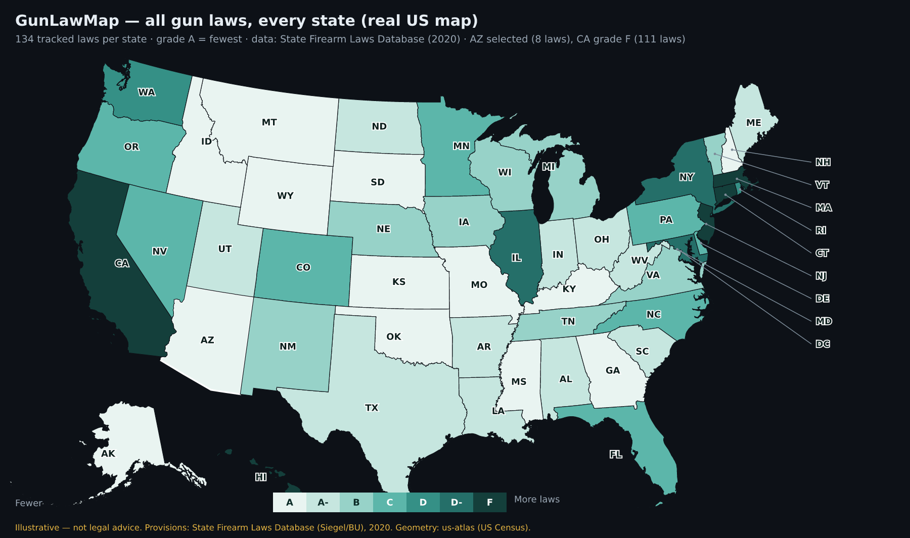

# GunLawMap

An **interactive US map of state firearm laws** that stays current as states enact,
amend, or repeal gun legislation. This repository currently holds the **project
plan and a working visual mockup** (concept stage).



> ⚠️ **Not legal advice.** All law data in the mockup is *illustrative sample data*
> for design purposes — not guaranteed current or accurate. A production build would
> cite primary statutes and stamp every fact with a source and a last-verified date.
> Always consult official state resources and an attorney.

## Data: all 134 tracked laws, every state

State law data comes from the **[State Firearm Laws Database](https://www.statefirearmlaws.org)**
(Siegel et al., Boston University) — **134 firearm-law provisions across 14 categories
for all 50 states**, latest year **2020**. Each state's page lists every tracked law
it has in effect, grouped by category (California has 111; Arizona has 8). Category
labels are simplified renderings of the official codebook.

> ⚠️ The dataset's latest year is **2020**, so changes since then (e.g. several states
> adopting permitless carry in 2021–2024) are not yet reflected. Keeping it current is
> exactly what the update pipeline in [`docs/PLAN.md`](docs/PLAN.md) §6 is for. DC isn't
> in the 50-state database, so it shows a curated summary.

## Grading orientation

A state's **grade reflects how few laws/restrictions it imposes**:

- **A = fewest** (e.g. Arizona, 8 laws), **F = most** (e.g. California, 111 laws).
- Derived from `lawtotal` (count of the 134 tracked provisions in effect):
  0–9 → A, 10–19 → A-, 20–29 → B, 30–44 → C, 45–59 → D, 60–79 → D-, 80+ → F.
- This is the **opposite orientation** from gun-safety scorecards (e.g. Giffords),
  which grade more restrictions as an A.

## What's here

| Path | What it is |
|---|---|
| [`mockup/index.html`](mockup/index.html) | **Interactive visual mockup** — self-contained, no dependencies. Real geographic US map; all 50 states + DC with every tracked law. |
| [`mockup/preview.png`](mockup/preview.png) | Static preview of the map (shown above). |
| [`web/`](web/) | **Phase-1 Next.js + Postgres app** (the real build): geographic map, Prisma data spine, seed, API. See `web/README.md`. |
| [`data/sample-states.json`](data/sample-states.json) | Canonical dataset — 50 states + DC, each with its tracked laws. Built by `tools/build-from-sfl.js` from `data/sources/State_laws.xlsx` using `tools/sfl-codebook.js`. |
| [`docs/PLAN.md`](docs/PLAN.md) | Detailed build plan: vision, scope, data sources, the auto-update pipeline, architecture, stack, roadmap, risks. |
| [`docs/DATA-MODEL.md`](docs/DATA-MODEL.md) | Versioned, provenance-first database schema. |
| [`docs/WIREFRAME.md`](docs/WIREFRAME.md) | ASCII wireframe of the UI for quick reference. |

## View the mockup

It's a single static file — no build step.

```bash
# macOS
open mockup/index.html
# Linux
xdg-open mockup/index.html
# …or just drag mockup/index.html into a browser tab
```

### What the mockup demonstrates
- A **real geographic US map** (Albers-USA projection, Alaska & Hawaii inset), one
  clickable state per shape, color-coded by grade.
- **Color modes** to recolor the whole map by a single policy (permitless carry,
  universal background checks, red-flag laws).
- A **state detail panel** for **all 50 states + DC** showing the grade, the law
  count (out of 134), at-a-glance policy flags, and **every tracked law in effect,
  grouped by category** (scrollable — California lists 111).
- A **"recent & pending changes" feed** — the design hook for the auto-updating
  behavior — with status tags (Enacted / Effective / Court ruling / In committee)
  and a dashed-gold outline on states with a recent change.
- Search, a filterable legend, and a persistent **"not legal advice"** disclaimer.

Map geometry comes from [us-atlas](https://github.com/topojson/us-atlas) (US Census
TIGER, public domain; us-atlas is ISC-licensed), inlined as SVG paths so the file
stays self-contained.

## The core idea: staying current

The map keeping itself up to date is the central challenge. The plan's approach
(see [`docs/PLAN.md`](docs/PLAN.md) §6) is a **detect → draft → review → publish**
pipeline:

1. **Detect** — scheduled jobs watch legislative + court trackers
   ([LegiScan](https://legiscan.com/legiscan),
   [Open States](https://docs.openstates.org/api-v3/), court dockets) plus baseline
   datasets ([RAND](https://www.rand.org/research/gun-policy/tools-and-data.html),
   [Giffords](https://giffords.org/lawcenter/resources/scorecard/)).
2. **Draft** — a classifier maps each event to a tracked provision and drafts a
   plain-language change.
3. **Review** — a human editor confirms against the **primary statute** (nothing
   publishes automatically).
4. **Publish** — a new versioned record + a changelog entry + subscriber
   notifications.

This human-in-the-loop design is deliberate: firearm law is too consequential to
publish from an unreviewed scraper.

## Status & next steps

Concept stage. The suggested build order is in the plan's roadmap
([`docs/PLAN.md`](docs/PLAN.md) §12): data spine → public MVP → live-update
pipeline → subscriptions → historical/API depth.
